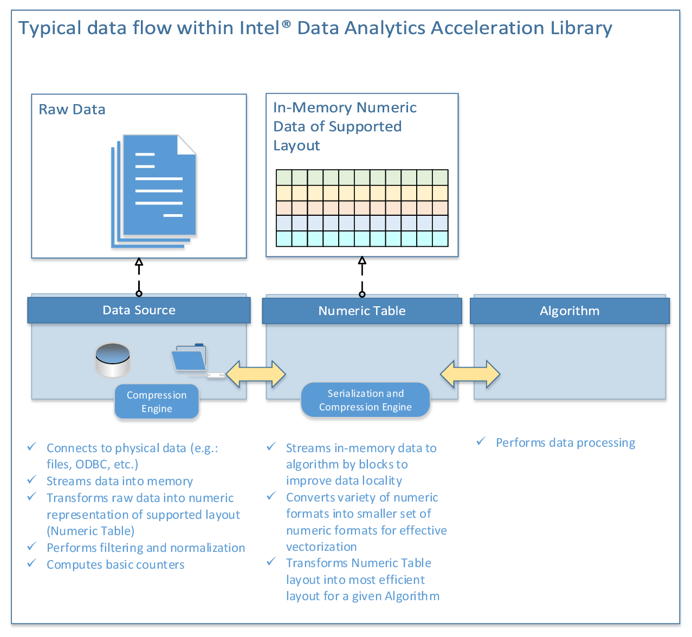
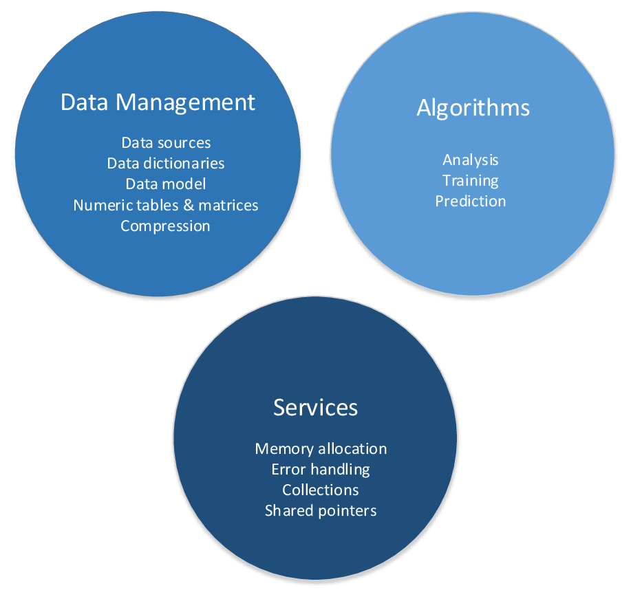
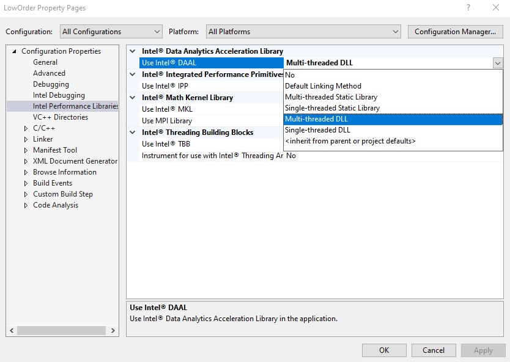
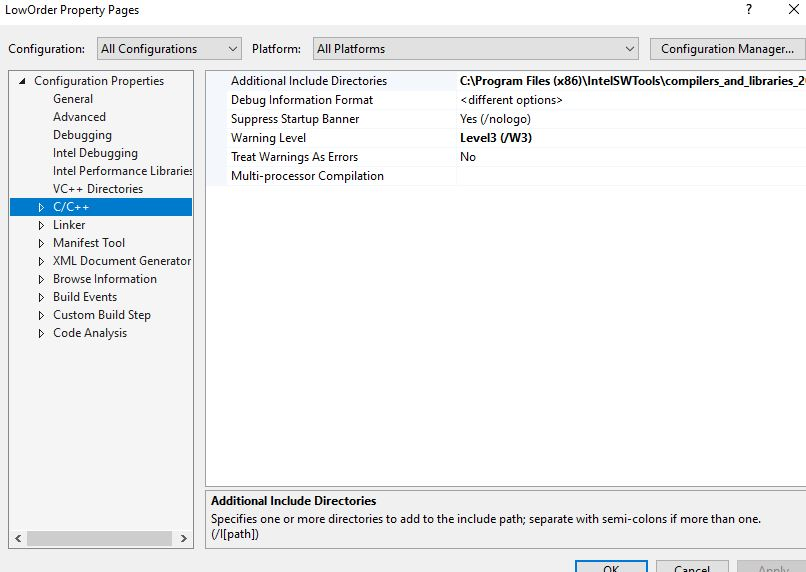
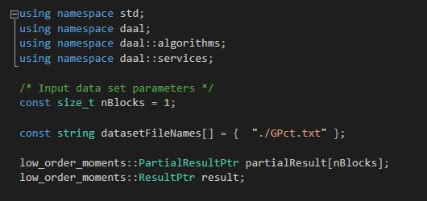
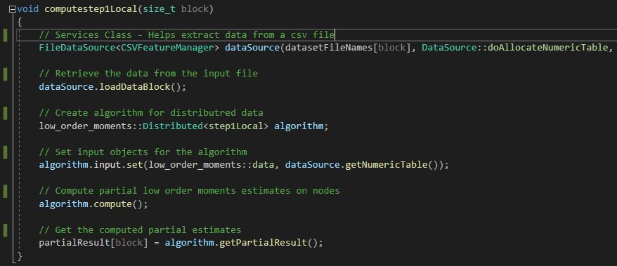
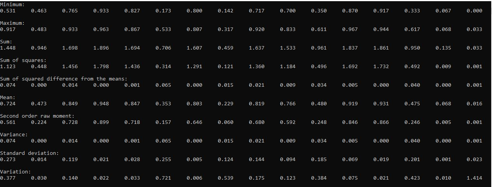
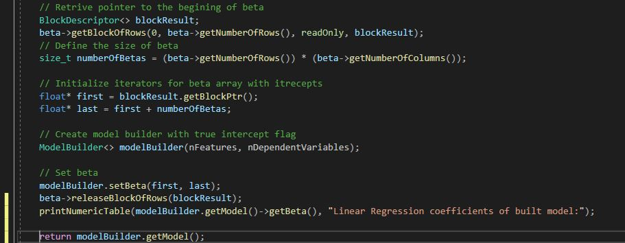
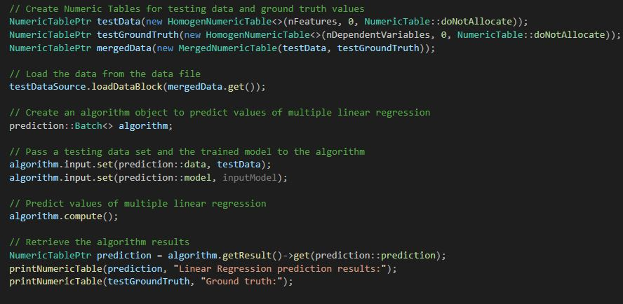
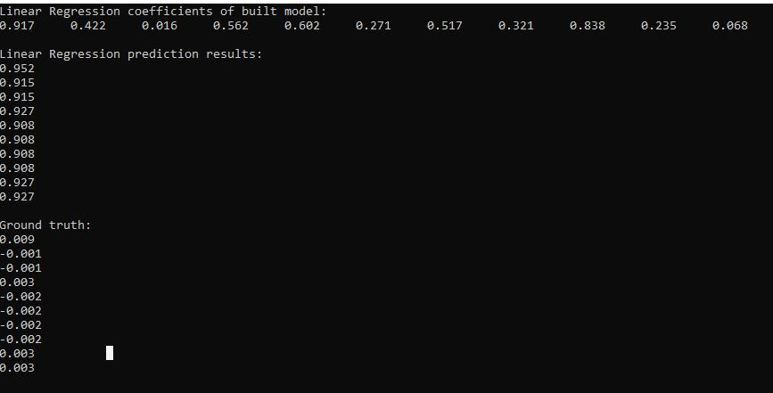

# Intel Data Analysis Acceleration Library

## Introduction
***

The Intel DAAL provides  high efficiency algorithms for the purposes of analyzing, training, and predicting big datasets. The Intel DAAL was initially released in 2015 and has since been updated earlier this year. The library is comprised of three major components:
  * The Data Management component includes classes and utilities for data acquisition, initial preprocessing and normalization, for 
    data conversion into numeric formats done by one of supported Data Sources, and for model representation.
  * The Algorithms component consists of classes that implement algorithms for data analysis (data mining), and data modeling 
    (training and prediction).
  * The Services component includes classes and utilities used across Data Management and Algorithms components.

## Project Scope
***

The LA Dodgers are one of my favorite baseball teams and baseball is a sport that uses mathematical analytics to predict success. I am going to use Intel’s Data Analysis Acceleration Library to predict the LA Dodgers batting stats for the 2021 baseball season. The MLB hasn’t announced how many games the next season will have because of Covid-19 so, the program will be able to adjust based on the number of games. I am going to focus on the following features of DAAL, Low Order, Regression Analysis, and Distributed Processing. I am going to use statistics from the last 2 years from baseball reference. 

## Functions of Intel DAAL
***

**Analysis**
 - Low Order Moments
 - Quantiles
 - Correlation matrix and variance-covariance matrix
 - Cosine distance matrix
 - Correlation distance matrix
 - Clustering 
 - Principal Component Analysis
 - Association rules mining
 - Outlier detection

**Training and Prediction**
- Regression
   - Linear regression
- Classification: 
- Recommendation systems
   - Neural networks

**Intel DAAL uses three processing modes:**

- Batch Processing

- Online Processing

- Distributed Processing

## How It Works
***

## How to use DAAL
***

## Project - Low Order - Distributed
***

## Project - Regression Analysis
***

## To Learn More
https://software.intel.com/content/www/us/en/develop/documentation/get-started-with-daal-for-windows/top.html
